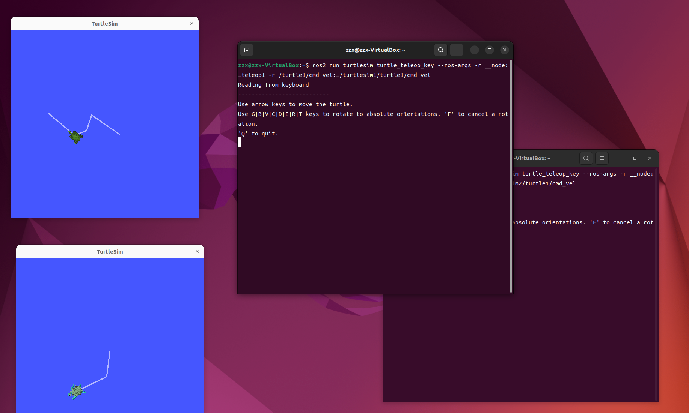
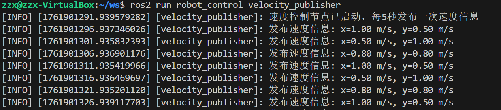
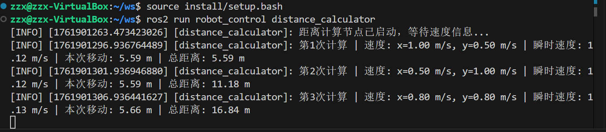

# LAB2 
23302010046 张子鑫
## 1.实验一
开启四个终端各自分别运行：
```
# 终端1 - 第一个海龟模拟器
ros2 run turtlesim turtlesim_node --ros-args -r __node:=turtlesim1 -r /turtle1/cmd_vel:=/turtlesim1/turtle1/cmd_vel
# 终端2 - 第二个海龟模拟器
ros2 run turtlesim turtlesim_node --ros-args -r __node:=turtlesim2 -r /turtle1/cmd_vel:=/turtlesim2/turtle1/cmd_vel
# 终端3 - 第一个控制节点
ros2 run turtlesim turtle_teleop_key --ros-args -r __node:=teleop1 -r /turtle1/cmd_vel:=/turtlesim1/turtle1/cmd_vel
# 终端4 - 第二个控制节点
ros2 run turtlesim turtle_teleop_key --ros-args -r __node:=teleop2 -r /turtle1/cmd_vel:=/turtlesim2/turtle1/cmd_vel
```
## 运行结果

## 2.实验二
### 2.1 代码实现思路
#### 2.1.1 创建消息
创建自定义消息接口 MyMessage，包含 x_velocity和 y_velocity两个浮点数字段
使用 ROS2 的消息生成系统自动生成 Python 绑定
#### 2.1.2 速度控制节点
​- 定时发布机制​​：使用 ROS2 的定时器功能，每5秒触发一次函数
```
        # 创建定时器，每5秒发布一次速度信息
        timer_period = 5.0  # 5秒
        self.timer = self.create_timer(timer_period, self.timer_callback)
        self.count = 0
```
​​- 速度模拟​​：通过循环计数器模拟三种不同的速度组合，实现速度变化
```
        if self.count % 3 == 0:
            msg.x_velocity = 1.0  # x方向速度 1.0 m/s
            msg.y_velocity = 0.5  # y方向速度 0.5 m/s
        elif self.count % 3 == 1:
            msg.x_velocity = 0.5  # x方向速度 0.5 m/s
            msg.y_velocity = 1.0  # y方向速度 1.0 m/s
        else:
            msg.x_velocity = 0.8  # x方向速度 0.8 m/s
            msg.y_velocity = 0.8  # y方向速度 0.8 m/s
```
​​- 消息发布​​：创建 MyMessage实例并发布到 robot_velocity话题
```
        # 发布速度信息
        self.publisher_.publish(msg)
        self.get_logger().info('发布速度信息: x=%.2f m/s, y=%.2f m/s' % 
                              (msg.x_velocity, msg.y_velocity))
        self.count += 1
```
#### 2.1.3 距离计算节点
- 消息订阅​​：订阅 robot_velocity话题，接收速度信息
```
        self.subscription = self.create_subscription(
            MyMessage,
            'robot_velocity',  # 订阅的话题名称
            self.velocity_callback,
            10)
```
- ​​向量计算​​：使用数学公式计算速度向量的模长（瞬时速度）
```
        # 计算瞬时速度大小（向量模长）
        instantaneous_speed = math.sqrt(
            msg.x_velocity**2 + msg.y_velocity**2
        )
        
        # 计算这段时间内的移动距离
        distance_increment = instantaneous_speed * time_interval
        
```
- 距离积分​​：基于时间间隔（5秒）计算每次移动的距离，并累加得到总距离
```
        # 累加总距离
        self.total_distance += distance_increment
        self.message_count += 1
```
- 实时输出​​：将每次计算的结果格式化输出到控制台
### 2.2实验结果
#### 命令测试

#### 速度

#### 距离
