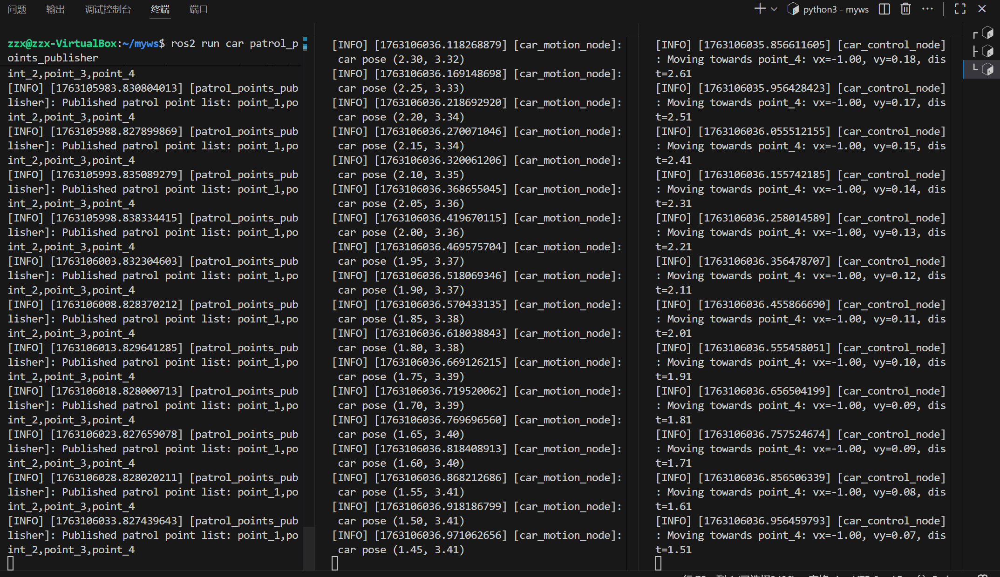

# LAB4
23302010046 张子鑫
## 1.总体框架
该代码实现主要由三个部分组成；
```
patrol_points_publisher.py
car_control_node.py
car_motion_node.py
```
patrol_points_publisher实现巡逻点信息发布，car_motion_node实现
## 2.具体代码实现
### 2.1 patrol_points_publisher
- 1.节点初始化
启动一个 ROS2 节点，并创建 StaticTransformBroadcaster 用于发送静态 TF。
- 2.巡逻点定义
每个巡逻点由三个变量组成：
名称，x 坐标，y 坐标
小车将根据这些巡逻点顺序巡逻。
- 3.发布巡逻点名称列表，发布静态 TF
坐标通过 Static TF 发布，仅发布一次即可，每个巡逻点在 RViz2 中都是一个独立坐标系
### 2.2 car_motion_node
该节点负责模拟小车在二维平面中的运动，并实时发布小车相对于 world 坐标系的动态变换，该节点订阅控制节点发布的速度信息 /cmd_vel，根据速度做积分计算位置
- 1.节点初始化
订阅话题 /cmd_vel，获取小车的线速度
- 2.小车状态初始化
```
self.x = 0.0
self.y = 0.0
self.vx = 0.0
self.vy = 0.0
self.last_time = self.get_clock().now()
```
last_time 用于记录小车上一次的位置
- 3.订阅速度命令回调，更新小车位置，发布 TF（world → car）
每一次更新，小车都会发布自己的位置信息
### 2.3 car_control_node
负责根据巡逻点的位置计算小车需要的速度指令，并将速度发布给 car_motion_node。
- 1.初始化
```
self.tf_buffer = Buffer()
self.tf_listener = TransformListener(self.tf_buffer, self)
self.pub = self.create_publisher(Twist, 'cmd_vel', 10)
```
发布者 /cmd_vel：发布 Twist 消息作为小车的控制输入（vx, vy）
- 2.接受巡逻点列表
```
self.create_subscription(String, 'patrol_points', self.patrol_points_cb, 10)
```
将 “point_1,point_2,point_3...” 转换为列表,第一次收到巡逻点时初始化 current_idx 为 0,之后更新列表但不重置巡逻顺序
- 3.控制循环 control_loop
a.获取当前目标点,从 TF 查询位置,计算与目标点的误差
b.判断是否到达目标点:到达目标点 → 切换下一个目标
```
if dist < self.arrival_tol:
    self.current_idx = (self.current_idx + 1) % len(self.patrol_points)
    self.pub.publish(Twist())  # 停止
    return
```
c. 速度控制
小车越远速度越大，越近速度越小
```
vx = self.kp * dx
vy = self.kp * dy
```
d.发布速度指令
```
twist = Twist()
twist.linear.x = float(vx)
twist.linear.y = float(vy)
self.pub.publish(twist)
```
## 3.实现结果
小车在预设定的point 1-4 之间巡逻，发布小车的位置和速度信息
