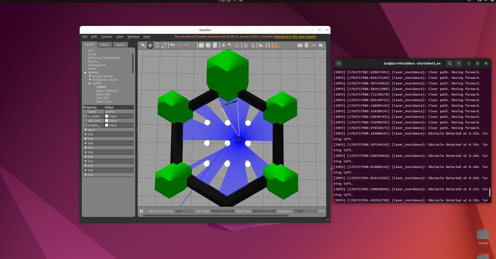

# LAB5
23302010046 张子鑫
## 1. 代码实现
### 1.1.总体介绍
- 添加了一个小车的节点，小车能自动检测障碍物并且转向
### 1.2.具体实现
- 躲避障碍由avoidance.py实现
#### ```avoidance.py```
- 小车初始化数据
```
        # 声明并获取参数 
        self.declare_parameter("linear", 0.4)
        self.linear = self.get_parameter('linear').get_parameter_value().double_value # 直行速度
        self.declare_parameter("angular", 1.0)
        self.angular = self.get_parameter('angular').get_parameter_value().double_value # 转向角速度
        self.declare_parameter("LaserAngle", 45.0)
        self.LaserAngle = self.get_parameter('LaserAngle').get_parameter_value().double_value # 避障检测角度 (单侧) [cite: 77]
        self.declare_parameter("ResponseDist", 0.45)
        self.ResponseDist = self.get_parameter('ResponseDist').get_parameter_value().double_value # 避障响应距离 [cite: 79]

        # 订阅雷达数据话题 /scan 
        self.sub_laser = self.create_subscription(LaserScan, "/scan", self.registerScan, 1)
        # 发布小车速度话题 /cmd_vel 
        self.pub_vel = self.create_publisher(TwistStamped, '/cmd_vel', 1)
        
        self.get_logger().info("Laser Avoidance Node started")
```
- 躲避障碍实现逻辑
- 1.计算要检测的雷达数据的索引范围
LaserScan 的 ranges 数组索引是围绕机器人中心排列的。
0 度（正前方）位于数组的中间或开始/结束处，具体取决于雷达配置。
TurtleBot3 的 /scan 话题通常从负角度开始，0度在中间附近。
直接获取前方中央 N 个点，提取前方中央 90 度
- 2.检查障碍物
```
        # 过滤掉无效值并找到区域内的最小距离
        min_dist = np.min(front_ranges[np.isfinite(front_ranges)])
```
- 3.生成速度命令
遇到障碍：停下并转向。
转向逻辑：默认向左转,无障碍：直行 
```
        ts = TwistStamped()
        ts.header.stamp = self.get_clock().now().to_msg()
        
        if min_dist < self.ResponseDist:
            ts.twist.linear.x = 0.0 
            
            ts.twist.angular.z = self.angular 
            self.get_logger().info(f"Obstacle detected at {min_dist:.2f}m. Turning left.")
        else:
            ts.twist.linear.x = self.linear 
            ts.twist.angular.z = 0.0
            self.get_logger().info("Clear path. Moving forward.")
            
        # 发布速度
        self.pub_vel.publish(ts)
```
## 2. 测试结果
运行：
```
ros2 launch turtlebot3_gazebo empty_world.launch.py
source ~/turtlebot3_ws/install/setup.bash
ros2 run wanderbot_controller avoidance_node
```
