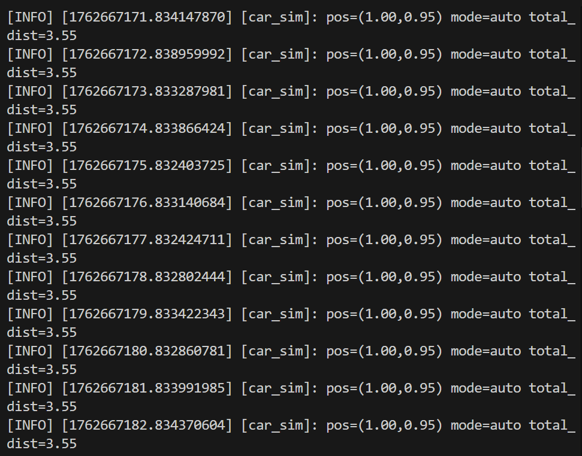
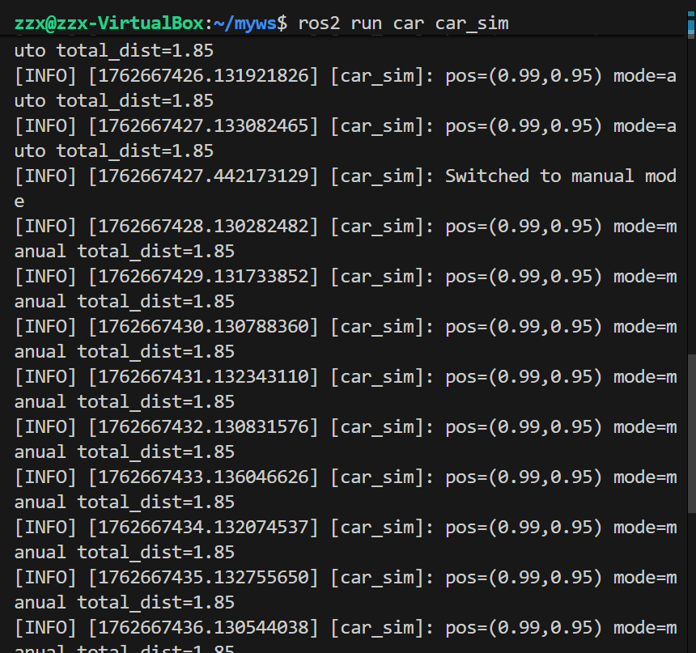
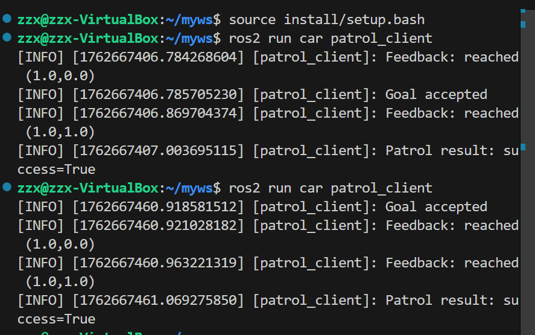
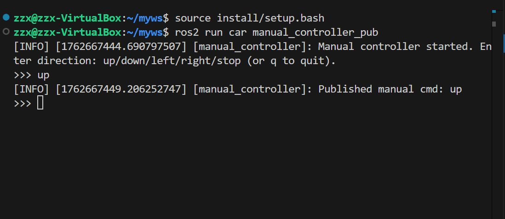
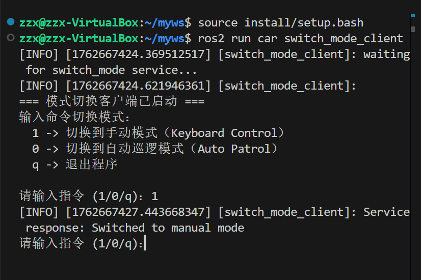

# LAB3
## 1.代码实现
### 1.1 总体介绍
- 由两个包实现：car,my_interfaces
car负责实现小车节点，my_interfaces实现消息接口
### 1.2 具体实现
#### 1.2.1 小车
- 小车节点由四部分组成：
```
car_sim 
patrol_client 
switch_mode_client 
manual_controller_pub 
```
- car_sim 实现小车运动（默认自动运动）
- patrol_client 实现传递运动消息
- switch_mode_client 实现传递改变运动模式的消息
- manual_controller_pub 实现对小车的手动控制
##### 1. car_sim
###### 节点初始
```
super().__init__("car_sim")
```
创建 ROS2 节点名为 car_sim。
- 该节点初始化了以下内容：
- 位置状态变量（self.position）：记录当前坐标 (x, y, z)；
- 模式标志（self.mode_keyboard）：False 表示自动模式，True 表示手动模式；
- 距离累计（self.total_distance）：统计车辆累计行驶的总距离；
- 手动指令缓存（self.manual_cmd）；
- 线程锁（self._lock）：用于多线程并发访问时保护共享变量。
（2）Action Server：自动巡逻执行模块
（3）Service Server：模式切换服务
（4）Subscriber：手动控制话题订阅
（5）定时器与状态打印
###### 运动逻辑实现
（1）自动模式运动
在 execute_callback 中：对每个目标点计算方向向量 (dx, dy)；以固定步长 speed * dt 移动；当距离小于容差（tolerance = 0.1）时认为到达；每完成一个点，发送反馈消息。
（2）手动模式运动
根据用户输入命令计算每次的 (dx, dy) 位移，实现键盘方向控制。
```
def _manual_move(self, speed, dt):
    if cmd == 'up': return (0.0, step)
    elif cmd == 'down': return (0.0, -step)
    elif cmd == 'left': return (-step, 0.0)
    elif cmd == 'right': return (step, 0.0)
    else: return (0.0, 0.0)
```
##### 2.patrol_client 
核心类：PatrolClient
- 初始化
调用父类 Node 构造函数，创建节点名为 patrol_client。创建一个 ActionClient，类型为 Patrol，对应服务端的 action 名称 'patrol_action'。这与 car_sim 中的 ActionServer 对应。
- 发送巡逻目标
wait_for_server()：等待 car_sim 节点的 action 服务器启动。构造一个 Patrol.Goal 消息，其中包含巡逻路径点 points。使用 send_goal_async() 异步发送目标。
注册两个回调函数：
feedback_callback：接收反馈（车辆到达某个点）。
add_done_callback()：目标被服务器接受或拒绝时调用 _goal_response_cb()。
- 处理目标响应
如果服务器拒绝目标，打印提示。
如果目标被接受，注册 _get_result_cb()，在巡逻任务结束后获取最终结果。
- 获取任务结果
当服务器返回任务完成结果时被调用。输出任务是否成功，然后关闭 ROS 2 系统。
- 接收任务反馈
每当车辆到达一个中间目标点，car_sim 会发送 feedback。此函数打印当前到达的坐标，实时反馈车辆的进度。
##### 3.switch_mode_client 
- 初始化函数
创建一个名为 switch_mode_client 的 ROS 2 节点。
创建服务客户端，服务类型为 SwitchMode，对应服务名为 'switch_mode'。
若服务器（即 car_sim）尚未启动，则持续等待，打印提示信息。
该服务与 car_sim 中的 create_service(SwitchMode, 'switch_mode', ...) 完全对应。
- 发送服务请求
构造一个 SwitchMode.Request 请求对象。
keyboard_control 参数为 True 表示手动模式，False 表示自动模式。
使用异步调用 call_async() 发送请求。
通过 rclpy.spin_until_future_complete() 等待服务返回。
输出服务端的响应结果（例如 “Switched to manual mode”）。
```
def call_switch(self, keyboard_control: bool):
    req = SwitchMode.Request()
    req.keyboard_control = keyboard_control
    future = self.cli.call_async(req)
    rclpy.spin_until_future_complete(self, future)
    if future.result() is not None:
        self.get_logger().info(f'Service response: {future.result().message}')
    else:
        self.get_logger().info('Service call failed')
```
##### 4.manual_controller_pub
- 初始化
创建一个 ROS 2 节点，节点名为 manual_controller。
创建一个发布者（Publisher）：
消息类型为 String；
话题名为 'manual_cmd'；
队列长度为 10
这个话题名与 car_sim 中的订阅者完全一致：
```
self.create_subscription(String, 'manual_cmd', self.manual_cmd_callback, 10)
```
- 发布函数
创建一个 String 类型消息；将输入的字符串 cmd 赋值给 msg.data；调用 publish() 方法发布；
输出日志信息以便调试
```
def publish_cmd(self, cmd: str):
    msg = String()
    msg.data = cmd
    self.pub.publish(msg)
    self.get_logger().info(f'Published manual cmd: {cmd}')
```
## 2.实现结果
- car_sim
自动巡逻

手动巡逻

- patrol_client

- manual_controller_pub

- switch_mode_client 
